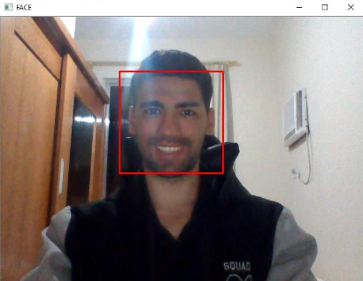
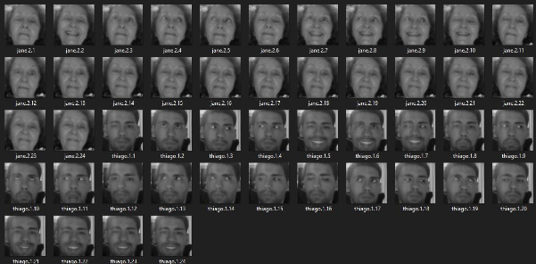
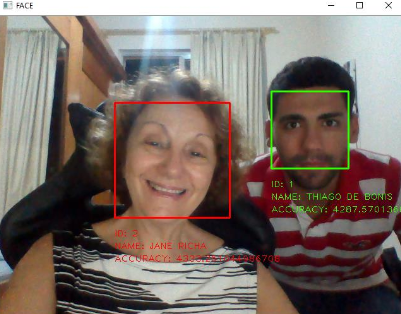

<h1 align="center">
    
</h1>

<h3 align="center">
  Facial Recognition and Detection
</h3>

<blockquote align="center">
“To be successful, it is necessary to truly love what you do. Otherwise, taking into account only the rational side, you simply give up. This is what happens to most people.”

 -Steve Jobs
</blockquote>

  

  

  
  

  

  

  

  <a href="#video_camera-about-this-prototype">About this prototype</a>&nbsp;&nbsp;&nbsp;
  |&nbsp;&nbsp;&nbsp;<a href="#electric_plug-how-to-use">How to Use</a>
  &nbsp;
  |&nbsp;&nbsp;&nbsp;<a href="#memo-license">License</a>

## :video_camera: About this prototype

This prototype is related to my defense of my Bachelor of Science degree in Computer Science, where I covered facial recognition and detection algorithms machine learning and deep learning techniques to improve detection rates, and the use of these techniques to benefit public security.

**Keywords:** Public Safety, Face Recognition, OpenCV, Python, Viola-Jones Algorithm, Eigenface Algorithm, Fisherface Algorithm.

The techniques used for **Detection** or **Facial Recognition** are:
- **VIOLA-JONES ALGORITHM**
- **EIGENFACE ALGORITHM**
- **FISHERFACE ALGORITHM**

**attention:** I must remember that the purpose of this prototype is to demonstrate its capacity **using the minimum possible resources**, such as, for example, few samples (faces), undefined parameters and etc. 

**If you are interested in knowing a little more about me and even reading my thesis, visit the following links:**

- :link: [LINKEDIN](https://www.linkedin.com/in/thiagodebonisoficial/)
- :link: [MONOGRAPHY](https://1drv.ms/b/s!AuKQw8V2etKHhQ2lOuoIm05TWtMA?e=xLUttL)

## :electric_plug: How to use

**This project was developed using the IDE called** [PYCHARM](https://www.jetbrains.com/pycharm/), **so so that there is no problem use it too!** **If you still don't have** [PYTHON](https://www.python.org/) **3.7x installed**, **don't forget to install and restart your machine!**

After that open `Pycharm` and if you need to configure the `Python` interpreter as follows:

- Click on `Configure Python Interpreter`;
- Go to `Project: facerecognition-prototype` the `Project Interpreter` and click on the gear icon (⚙️) at the top of the right side and then on `Add`;
- A window will open, now in `Virtualenv Environment` select` New environment` and in `Base interpreter` select the path of your `python.exe` and click `OK`;

After that the python interpreter will be properly configured, first of all do this check like this:

- Click on `File` and then on` Settings`;
- Access `Project Interpreter` in `Project: facerecognition-prototype` and check if the python interpreter on the right side is selected in `Project Interpreter`;
- If everything is fine, if not, select and click `OK`;

Finally this project uses some separate modules which need to be installed, then follow the steps above to the `Project Interpreter` area, after that do the following:

- Click the plus sign icon (**+**)...
- A window will open, in the search area search separately for the following `packages`:` numpy`, `matplotlib`,` opencv-python`, `opencv-contrib`,` cv2`;
- After finding each `package`, separately select it and click on` Install Package`;

The operation of this algorithm is quite simple, when it is initialized it asks for two inputs as input (which are: the `name` and the` id`, this information is stored together with their respective samples (faces), the which in the step of facial recognition will be used to point out the recognized individual, **Figure 2** illustrates well its form of storage. Then we use a classifier called `“haarcascade_frontalface_default.xml”`, this classifier is an `XML` file which comes together with the **Viola-Jones algorithm**, and the same is the training done with **Adabooster**, with this classifier we can recognize the object that in this case is the face.

Soon afterwards it is necessary to extract the samples (face), and for this it is mandatory to follow the following three simple rules:

- Have an **average** greater than **85**.
- Check if your face is surrounded by the **red rectangle**.
- Press the `"Q"` key on your keyboard.

The **average** is nothing more than a numerical value which represents the illumination of the image being detected. This value was defined as greater than **85**, since the environment to which the face was being extracted had reasonable lighting, with this value we created a parameter for “good samples” and thus the user will only be able to extract the sample if its **lighting** is greater that **85** and the visible **“red rectangle”**. **Figure 1** illustrates the three rules cited being satisfied.

<h4 align="center">Figure 1</h4>
<h1 align="center" style="border-bottom: 0">
    
</h1>

**Figure 2** illustrates the extracted samples and their respective entries (`name` and `id`) stored in the folder called `“samples”`, which this folder is the local database used in the **second stage** for training and classification with the **Eigenface and Fisherface algorithms**.

<h4 align="center">Figure 2</h4>
<h1 align="center" style="border-bottom: 0">
    
</h1>

The **second stage** involves the use of the **Eigenface and Fisherface Algorithms** so that we can **train and classify** the samples **extracted** in the **first stage**. This step has **two simple rules**, which are: 

- Have samples in **grayscale and sized** in the **same size**. 
- Have **two or more samples for training**.

**Attention:** It is necessary for the samples to be in **gray scale and scaled** to the **same size**. **If we do not have more than one sample the training will fail**, as it is mandatory in relation to the **LDA** to have **two or more samples** for a **good training and classification**, which implies the following **error message:** `“At least two classes are needed to perform the LDA. Reason: Only one class was given! in function 'cv :: LDA :: lda'”`.

**With all the simple rules satisfied**, it is possible to **start training and classification**, in this case each algorithm uses **different techniques** to **train and classify**, as for example, the **Eigenface algorithm** uses the **PCA** and the **Fisherface algorithm** uses the **LDA and KNN**.

This algorithm works as follows: We take all samples in the `“samples”` **folder** and **extract** their respective `name` and `id` from **each sample**. **Each algorithm** receives **each sample** and each respective `name` and `id`, this **generating a file** called `“classifierEigenface.yml”` and `“classifierFisher.yml”`, where these are saved in the `“classifiers”` **folder** and their purpose is the same as the `XML` file of the **Viola-Jones algorithm**.

And finally in the **third and last stage** we managed to do the **Facial Recognition**. The **facial recognition** in this **step** is divided into **two files**, which are respectively for **each algorithm (Eigenface and Fisherface)**, the **two have the same Recognition algorithm Facial**, the **only difference is the classifier** which is used, which are respectively `“classifierEigenface.yml”` for **Eigenface algorithm** and `“classifierFisherface.yml”` for **Fisherface algorithm**, and it is clear that **each algorithm has its training and classification technique** as mentioned above, with **differences** in several aspects in **facial recognition**.

The **algorithm** used in the **facial recognition** **process is similar** to the **first step algorithm**, which made the **detection and extraction of the faces**. In **this step** we also use the **Viola-Jonese algorithm**, your **Haar classifier**, so that we can **detect the face**, but we add a **few lines** of code which are related to: to the training files mentioned above, the **“predict”** method and the **“recovery**” of the `name` and face `id` for **displaying the information of the individual who has been recognized**.

For **facial recognition** to be done successfully, it is necessary to **first detect the face** with the **Viola-Jones algorithm** and the **Haar classifier (trained file)**, then **after detection the algorithm** uses the **“predict” function** which it **receives as a parameter the face extracted**, **resized and converted to gray scale and returns the result of recognition**, which the **first value returned** is the `id` associated with this class (`person`, `face`) that the **algorithm** **"believes to be"**, and the second value is the confidence level for this **“prediction”**, which corresponds to the **calculation** of the **distance between the tested face and the face that the algorithm found most similar using the KNN algorithm**.

If the **facial recognition is successful**, the individual will be identified with a **“green rectangle”** and his information will appear shortly thereafter, the **green color** indicates that this individual who was recognized is an individual wanted by the police in some way. If **facial recognition is successful and the individual is not pending with the law**, the individual will be identified with a **"red rectangle"** and their information will appear shortly thereafter.

**Figure 3** illustrates **two individuals** who are being recognized by the **facial recognition algorithm**, the individual with the **green rectangle** is sought by the Law in some way and is in the **database**, and the one with the **red rectangle** is an individual that is not in force with the Law and that is also in the **database**.

<h4 align="center">Figure 3</h4>
<h1 align="center" style="border-bottom: 0">
    
</h1>

## :memo: License

This project is under the MIT license. See the [LICENSE](LICENSE) for more details..
